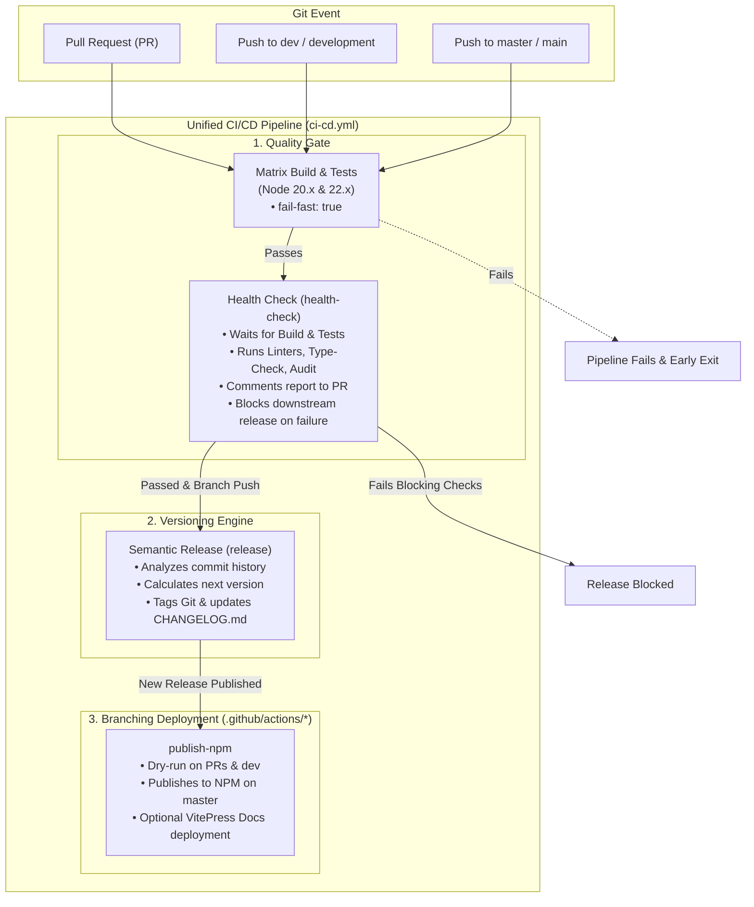

# Unified Release & CI/CD Process

This project uses a highly automated, sequential CI/CD and release pipeline powered by a **single unified GitHub Actions workflow** (`ci-cd.yml`), **modular composite actions** (`.github/actions/`), and **`semantic-release`**. This ensures quality control, automated semantic versioning, and secure deployments within a single, cohesive workflow run.

---

## Process Flow Diagram



---

## How It Works

### 1. The CI Gatekeeper (`build-and-test` & `health-check`)

Every push and pull request executes through continuous integration with strict **early-exit fail-fast** mechanisms:

1. **Matrix Build & Tests (`build-and-test`):**
   - Compiles all workspaces and the root app across supported Node.js versions (20.x, 22.x) and runs unit test suites.
   - **`fail-fast: true`:** If either Node runner fails, the entire matrix cancels immediately.
2. **Health Check (`health-check`):**
   - **`needs: build-and-test`:** Only starts **after** matrix builds and tests pass completely.
   - Runs format checks (Prettier), linters (ESLint, Stylelint), TypeScript type-checking (Vue TSC), and dependency audits.
   - Generates a markdown health report (`health-report.md`).
   - **On Pull Requests:** Posts or updates a single pinned summary comment on the PR.
   - **On Branch Pushes (`master`/`dev`):** Publishes the report to the GitHub Actions Job Summary.
   - **Release Gate:** If any blocking check fails, the health check exits with code 1, which blocks semantic versioning and deployment from ever running.

---

### 2. The Versioning Engine (`release`)

The versioning job runs sequentially in the same workflow after `health-check`:

- **Dependency:** `needs: health-check` — only triggers when quality checks pass on `master`, `main`, `dev`, or `development`.
- **Execution:**
  1. `semantic-release` analyzes commit messages since the last release according to [Conventional Commits](https://www.conventionalcommits.org/).
  2. It computes the appropriate version bump (`feat:` $\rightarrow$ minor, `fix:` $\rightarrow$ patch, `BREAKING CHANGE:` $\rightarrow$ major).
  3. Updates `package.json`, generates `CHANGELOG.md`, tags the Git repository, and publishes GitHub Release notes.
  4. Emits `new_release_published` and `new_release_version` outputs to downstream deployment jobs.

---

### 3. Modular Deployment (`publish-npm`)

Deployment logic is modularized into reusable **composite actions** under `.github/actions/`:

| Action | Target | Behavior |
| :--- | :--- | :--- |
| **`setup-node-build`** | All | Shared setup for Node.js caching, dependency installation (`npm ci`), and build execution. |
| **`publish-npm`** | Plugin | Handles `--dry-run` on PR/dev, live publishing to NPM on `master`, and optional VitePress docs deployment. |
| **`deploy-github-pages`** | Docs / Web App | Configures GitHub Pages, uploads dist artifact, and triggers deployment. |

---

### 4. Environment & Deployment Behaviors

| Stage | Pull Request (PR) | `dev` / Staging | `master` / Production |
| :--- | :--- | :--- | :--- |
| **Health Check (`npm run health-check`)** | 🩺 **Runs & comments on PR** | 🩺 **Runs & gates release** | 🩺 **Runs & gates release** |
| **NPM Package Publishing** | 🧪 **Dry Run** (`--dry-run`) | 🧪 **Dry Run** (`--dry-run`) | 🚀 **Live Publish** (`--access public`) |
| **VitePress Docs Deployment** | ⏭️ Skipped | ⏭️ Skipped | 🚀 **Deployed to GitHub Pages** *(if enabled)* |
| **Semantic Release Tag** | ⏭️ Skipped | 🏷️ Prerelease tag (`v1.0.0-dev.1`) | 🏷️ Official release tag (`v1.0.0`) |

---

## Developer & Agent Responsibilities

> [!IMPORTANT]  
> Because this system is completely automated and sequential, your primary responsibility is to **write meaningful commit messages** following the [Conventional Commits specification](https://www.conventionalcommits.org/en/v1.0.0/). Do not attempt to manually bump versions in `package.json` or manually create release tags.

### Commit Types and Release Triggers

#### Triggers a Release

- **`feat:`** - A new feature. Triggers a **MINOR** version bump (e.g., `1.0.0` $\rightarrow$ `1.1.0`).
- **`fix:`** - A bug fix. Triggers a **PATCH** version bump (e.g., `1.0.0` $\rightarrow$ `1.0.1`).
- **`perf:`** - A code change that improves performance. Triggers a **PATCH** version bump.
- **`BREAKING CHANGE:`** (or `!` after prefix like `feat!:`) - An API breaking change. Triggers a **MAJOR** version bump (e.g., `1.0.0` $\rightarrow$ `2.0.0`).

#### Does NOT Trigger a Release (Safe for internal updates)

- **`docs:`** - Documentation-only changes.
- **`chore:`** - Changes to build process, auxiliary tools, or dependencies.
- **`style:`** - Formatting, whitespace, or missing semi-colons.
- **`refactor:`** - Code changes that neither fix a bug nor add a feature.
- **`test:`** - Adding or updating test suites.
- **`ci:`** - Changes to CI/CD workflows and configuration scripts.

---

### Example Commit Commands

To update documentation without triggering a release:

```bash
git commit -m "docs: update readme with new API instructions"
```

To add a new feature that will be automatically deployed:

```bash
git commit -m "feat: add user authentication"
```
